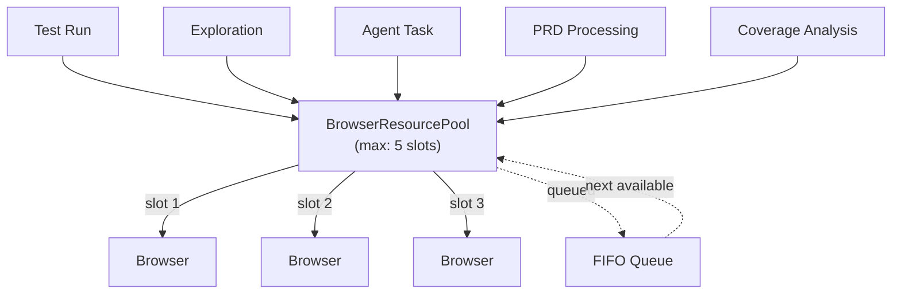
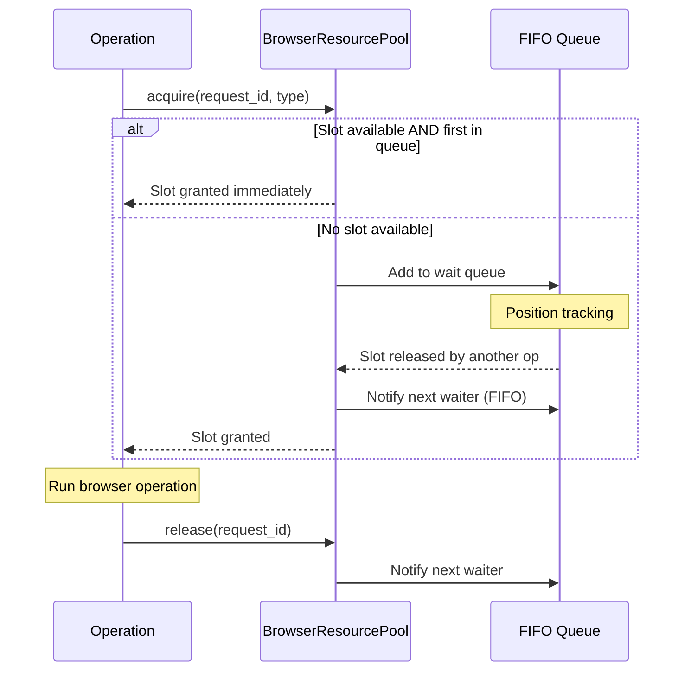
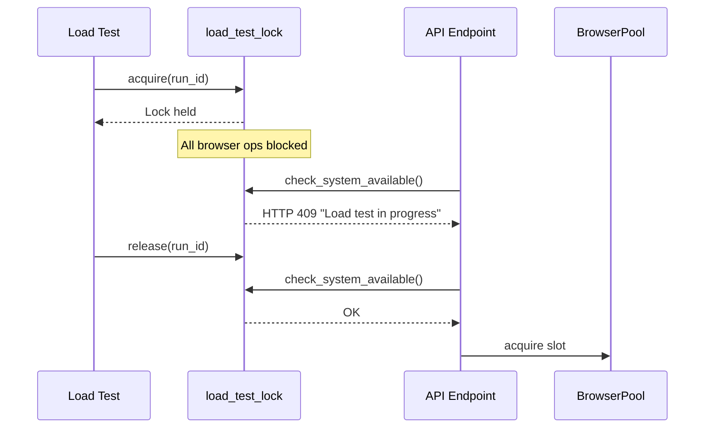

# Browser Pool and Concurrency

Browser automation is the most resource-intensive operation in Quorvex AI. Each Playwright browser instance consumes 200-500MB of RAM, significant CPU for rendering, and shared memory for Chromium's multi-process architecture. The browser pool exists to prevent resource exhaustion while maximizing throughput.

## Why a Unified Pool

Before the browser pool, different features managed browser resources independently: test runs used one semaphore, explorations used another, and PRD processing had no limits at all. This led to situations where 5 test runs, 3 explorations, and 2 PRD jobs all launched browsers simultaneously -- 10 Chromium instances on a machine that could handle 5.

The `BrowserResourcePool` singleton provides a single point of control. Every operation that needs a browser -- test runs, explorations, agent tasks, PRD processing, coverage analysis -- must acquire a slot from the same pool.



## Request Flow

When an operation requests a browser slot, the pool follows this sequence:



### FIFO Ordering

The queue uses strict FIFO ordering through `asyncio.Event` objects stored in a `deque`. When a slot is released, `_notify_next_waiter()` pops the first waiter from the deque, verifies the request is still valid (not timed out or cancelled), and sets its event. This prevents starvation: a request that has been waiting longest always gets served first.

### Slot Lifecycle

Each slot progresses through a defined state machine:

```
QUEUED -> RUNNING -> COMPLETED
                  -> FAILED
       -> CANCELLED (timeout or explicit cancel)
```

The `BrowserSlot` dataclass tracks timing at each transition: `queued_at`, `started_at`, `completed_at`. This enables monitoring dashboards to show wait times and run durations.

## Context Manager Pattern

The recommended way to use the pool is through the async context manager, which guarantees slot release even if the operation crashes:

```python title="orchestrator/api/process_manager.py"
async with pool.browser_slot(
    request_id="run_123",
    operation_type=OperationType.TEST_RUN,
    description="Test: login spec"
) as acquired:
    if acquired:
        # Run browser operation
        pass
    # Slot auto-released here, even on exception
```

Without the context manager, a crashed operation would hold its slot indefinitely, eventually exhausting the pool. The context manager converts this from a common bug into an impossible one.

## Timeout and Stale Slot Recovery

Two timeout mechanisms protect against stuck operations:

**Acquisition timeout** (`BROWSER_SLOT_TIMEOUT`, default: 3600s): How long a queued request will wait for a slot. If no slot becomes available within this window, the request is cancelled with a timeout error. This prevents indefinite blocking in the API layer.

**Operation timeout** (per-slot `max_operation_duration`): How long a running operation can hold a slot. The `cleanup_stale()` method, called periodically, forcibly releases slots that have exceeded their duration. This recovers from crashed processes that never called `release()`.

```python
# Stale cleanup runs on startup and periodically
stale_ids = await pool.cleanup_stale(max_age_minutes=60)
# Also cleans old completed records to prevent memory growth
await pool.cleanup_old_completed(max_age_hours=24)
```

## Load Test Lock Integration

Load tests (K6) generate massive network traffic that can interfere with browser operations. The `load_test_lock` module provides an exclusive lock that **pauses all browser operations** during active load tests.



**Why pause browser ops?** Load tests simulate hundreds or thousands of virtual users hitting the target application. Running Playwright tests simultaneously would produce unreliable results (the application is under artificial load) and consume resources that K6 needs.

The lock uses Redis when available (with a 2-hour TTL as a safety net against crashes) and falls back to an in-memory lock for development. API endpoints that start browser operations call `check_system_available()` before acquiring a pool slot, receiving an HTTP 409 if a load test is active.

## In-Memory vs Redis Pool

The pool has two implementations, chosen automatically based on configuration:

| Feature | InMemoryBrowserPool | RedisBrowserResourcePool |
|---------|-------------------|-------------------------|
| Scope | Single process | Distributed across instances |
| State | Python dict + deque | Redis list + set |
| Use case | Development, single-server | Production with multiple API replicas |
| Queue ordering | Native FIFO (deque) | Redis LPOP (FIFO) |
| Crash recovery | Lost on restart | Survives API restarts |

**When to use Redis pool**: If you run multiple API instances (behind a load balancer or in Kubernetes), the in-memory pool cannot coordinate across instances. Two API replicas would each maintain independent pools, potentially allowing 10 concurrent browsers on a system configured for 5. The Redis pool shares state, enforcing the limit globally.

The factory function `get_browser_pool()` checks `BROWSER_POOL_TYPE` and `REDIS_URL` to select the implementation automatically:

```python
if pool_type == "redis" and redis_url:
    pool = RedisBrowserResourcePool(redis_url)
else:
    pool = InMemoryBrowserPool()  # default
```

## Scaling Options

The browser pool works with three scaling strategies:

### 1. Native Parallelism (Default)

All browsers run in the same process/container. Scaling is limited by the machine's RAM and CPU. Best for development and single-server deployments.

### 2. Docker Workers

Browser operations are distributed to isolated worker containers via a Redis job queue. The API server (backend-slim) does not run browsers itself. Each worker container gets dedicated RAM (2GB) and CPU limits.

```
backend-slim --> Redis job queue --> Worker 1
                                --> Worker 2
                                --> Worker N
```

Best for teams needing 5-10 concurrent browser operations on a single host.

### 3. Kubernetes HPA

Browser worker pods auto-scale based on CPU utilization (2-20 pods, 70% threshold). This provides elastic capacity that adapts to demand without manual intervention.

Best for enterprise deployments with variable load patterns.

!!! note "Pool limit vs worker count"
    `MAX_BROWSER_INSTANCES` controls the pool's concurrency limit, not the number of physical workers. In Docker Workers mode, you might have 8 worker containers but set `MAX_BROWSER_INSTANCES=5` to leave headroom for system resources. The pool enforces the limit regardless of how many workers exist.

## Monitoring

The pool exposes its status through the API:

- `GET /api/browser-pool/status` -- Current slot usage, queue depth, breakdown by operation type
- `GET /api/browser-pool/recent` -- Recent slot activity with wait times and run durations
- `POST /api/browser-pool/cleanup` -- Trigger manual stale slot cleanup

The dashboard displays pool status in real time, showing which operations are running, how many slots are available, and what is waiting in the queue.

## Related

- [System Overview](./system-overview.md) -- How the browser pool fits into the component architecture
- [Pipeline Architecture](./pipeline-architecture.md) -- How pipelines acquire browser slots
- [Infrastructure](./infrastructure.md) -- Docker and Kubernetes scaling options
- [Memory System](./memory-system.md) -- How memory reduces unnecessary browser operations
