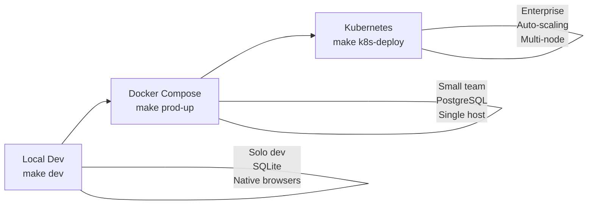
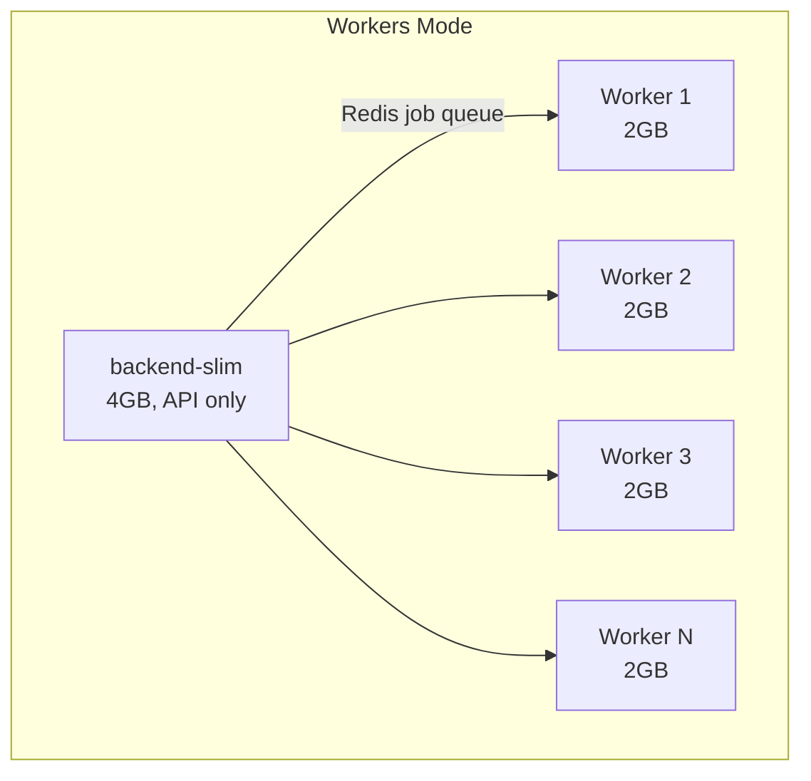
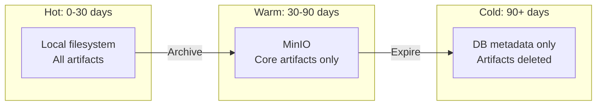

# Infrastructure & Deployment Design

Quorvex AI supports three deployment modes of increasing scale: local development, Docker Compose, and Kubernetes. This document explains the trade-offs behind each topology and why the infrastructure is structured the way it is.

## Deployment Spectrum

| Mode | Database | Browser Execution | Scaling | Setup Effort |
|------|----------|-------------------|---------|-------------|
| Local | SQLite | Native process | None | `make setup` |
| Docker Compose | PostgreSQL | Container (single or workers) | Manual | `make prod-up` |
| Kubernetes | PostgreSQL | HPA-managed pods | Automatic | `make k8s-deploy` |

## Why Docker Compose for Teams

Docker Compose strikes the right balance between reproducibility and simplicity for teams of 1-20 users. A single `docker-compose.prod.yml` file defines all services, volumes, networks, and health checks. There is no cluster to manage, no ingress controller to configure, and no persistent volume claims to provision.

The trade-off is limited scaling. Docker Compose can scale browser workers horizontally on a single host (`--scale browser-workers=N`), but cannot distribute work across multiple machines. For most teams, a single 8-core server with 32GB RAM handles 4-8 concurrent browser operations comfortably.

### Standard vs Workers Mode

Two Docker Compose profiles exist because browser automation has extreme resource requirements compared to API serving.

**Standard mode** bundles everything into a single 24GB container: the API server, Playwright browsers, and a VNC server for live viewing. This is simple to operate but wastes resources when the API is idle (most of the time) and limits browser scaling to the single container.

**Workers mode** separates the API (4GB slim container with no browsers) from browser workers (2GB each). This lets you scale browser capacity independently:

Workers mode is better for production because:
- A crashed browser worker does not bring down the API
- You can scale workers up during business hours and down at night
- The slim backend image is 6x smaller (4GB vs 24GB), speeding up deployments
- Browser isolation prevents memory leaks in Chromium from affecting the API

The cost is added complexity: Redis becomes required for job distribution, and you must manage multiple container types.

## Why Kubernetes for Enterprise

Kubernetes adds automatic scaling, self-healing, and multi-node distribution. The Horizontal Pod Autoscaler (HPA) watches CPU utilization on browser worker pods and scales between 2 and 20 replicas at a 70% CPU threshold.

**When to upgrade from Docker Compose to Kubernetes:**
- You need more than 10 concurrent browser operations
- You require zero-downtime deployments
- You want automatic recovery from node failures
- Multiple teams share the same installation

**What Kubernetes adds:**
- HPA for browser workers (CPU-based scaling)
- Rolling deployments for the backend (zero downtime)
- Ingress with TLS termination
- PersistentVolumeClaims for data durability across pod restarts
- Namespace isolation (`playwright-agent`)

**What Kubernetes costs:**
- Cluster management overhead (EKS, GKE, or self-managed)
- More complex debugging (kubectl logs, pod exec)
- Storage provisioner requirements for PVCs
- Ingress controller setup (nginx-ingress recommended)

## VNC: Live Browser Viewing

The standard Docker mode includes a VNC server that streams the browser display to the dashboard via WebSocket. This is valuable during debugging but imposes constraints:

- Requires a virtual framebuffer (Xvfb) and window manager (Fluxbox)
- Limits parallel execution to 1 browser (all browsers share the same display)
- Adds 4 supervisord processes (Xvfb, Fluxbox, x11vnc, websockify)
- Only available to superusers (security consideration)

Workers mode does not include VNC, trading live viewing for scalability. If you need both, run one standard container for VNC debugging alongside worker containers for parallel execution.

## Backup and Archival Strategy

The tiered storage system balances disk cost against data availability:

**Why three tiers?** Test run artifacts (screenshots, traces, HTML reports) consume significant disk space. A single run can produce 50-100MB of trace data. Over months, this adds up to hundreds of gigabytes. The tiered approach keeps recent data instantly accessible while automatically moving older data to cheaper storage.

**Hot tier** (0-30 days) keeps everything on the local filesystem for fast access. This is where active debugging happens.

**Warm tier** (30-90 days) moves only core artifacts (plan.json, validation.json, report.html) to MinIO. Screenshots and traces are deleted because they are rarely needed after the first month.

**Cold tier** (90+ days) deletes all artifacts, preserving only database metadata. You can still query historical pass/fail rates, but cannot view screenshots from old runs.

Configuration via `ARCHIVE_HOT_DAYS` (default: 30) and `ARCHIVE_TOTAL_DAYS` (default: 90) lets teams tune retention to their compliance requirements.

## Database Choice

The platform supports both SQLite and PostgreSQL through SQLModel/SQLAlchemy:

- **SQLite** for development: Zero configuration, single-file database, sufficient for a solo developer. No migrations needed (auto-created by `init_db()`).
- **PostgreSQL** for production: Concurrent write safety, proper ACID transactions, Alembic migrations for schema evolution.

!!! warning "Migration Boundary"
    SQLite uses auto-migration via `init_db()`. PostgreSQL uses Alembic (`make db-upgrade`). Existing databases created before Alembic was introduced need `make db-stamp R=001` to mark the current schema, then future migrations apply cleanly.

## Redis: Queue and Rate Limiter

Redis serves multiple roles in production:
- **Agent task queue**: Decouples API workers from long-running agent tasks
- **Job queue**: Distributes browser work to worker containers
- **Rate limiting**: Distributed counters for login and API throttling
- **Load test lock**: Exclusive lock preventing browser ops during K6 runs

The system falls back gracefully when Redis is unavailable: in-memory queues replace Redis queues, and rate limiting uses process-local storage. This means development works without Redis, but production benefits from it for distributed coordination.

## Resource Sizing

### Docker Compose (Standard)

| Resource | Minimum | Recommended |
|----------|---------|-------------|
| RAM | 16GB | 32GB+ |
| CPU | 4 cores | 8+ cores |
| Disk | 50GB | 200GB+ |

### Docker Compose (Workers)

| Component | RAM | Count |
|-----------|-----|-------|
| backend-slim | 4GB | 1 |
| browser-worker | 2GB each | 2-8 |
| PostgreSQL | 4GB | 1 |
| Redis + MinIO | 1.5GB | 1 each |

### Kubernetes

| Component | Requests | Limits |
|-----------|----------|--------|
| Backend pod | 1 CPU, 1Gi | 4 CPU, 4Gi |
| Worker pod | 1 CPU, 1Gi | 2 CPU, 2Gi + 1Gi shm |
| PostgreSQL | 256Mi | 1Gi |
| Redis | 64Mi | 256Mi |

!!! tip "Shared Memory for Chromium"
    Browser containers require at least 1GB of `/dev/shm` (shared memory). Without it, Chromium crashes with `SIGBUS` errors. Docker Compose sets `shm_size: 2gb` for standard mode and `1gb` for workers.

## Related

- [System Overview](./system-overview.md) -- How infrastructure supports the component architecture
- [Security Model](./security-model.md) -- Network isolation and container hardening
- [Deployment Guide](../guides/deployment.md) -- Step-by-step deployment instructions
- [Environment Variables](../reference/environment-variables.md) -- Configuration reference
- [Disaster Recovery](../guides/disaster-recovery.md) -- Backup and restore procedures
