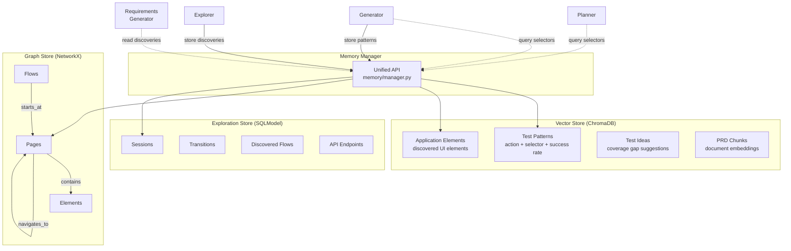
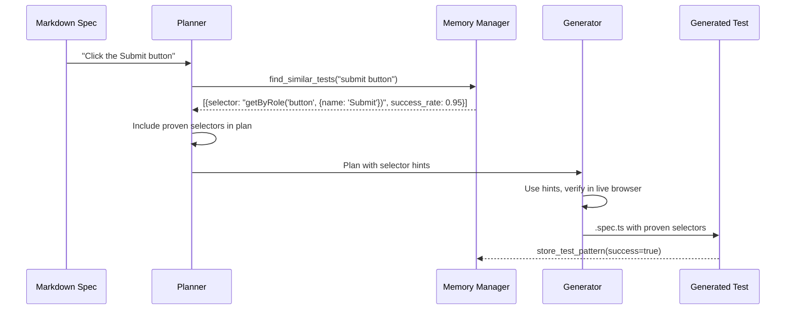

# Memory System

The memory system gives Quorvex AI the ability to learn from past test executions and application exploration. It stores proven selectors, application structure, and exploration discoveries, then feeds this knowledge back into test generation to produce more reliable tests.

## Why a Memory System Exists

Without memory, every test generation starts from scratch. The AI agent must discover selectors, navigate application structure, and figure out timing requirements independently for each spec. This leads to two problems:

1. **Repeated failures**: If `getByRole('button', {name: 'Submit'})` works on a login page, every future test touching that page should use it -- not rediscover it through trial and error.
2. **Disconnected knowledge**: Exploration sessions discover pages, flows, and API endpoints, but without persistent storage, that knowledge dies with the session.

The memory system solves both by acting as a shared knowledge base across pipeline runs.

## Architecture



The `MemoryManager` class provides a unified API that coordinates three underlying stores, each optimized for a different access pattern.

## Vector Store: Semantic Search

**Technology**: ChromaDB (embedded mode) with OpenAI embeddings

The vector store answers questions like "what selectors have worked for elements similar to this one?" It stores test patterns as text documents with metadata, embeds them using OpenAI's `text-embedding-3-small` model, and retrieves results by cosine similarity.

**Collections:**

| Collection | Purpose | Typical Query |
|------------|---------|--------------|
| `test_patterns` | Successful action + selector pairs | "click submit button on login form" |
| `application_elements` | Discovered UI elements | "password input field" |
| `test_ideas` | Coverage gap suggestions | "negative tests for checkout" |
| `prd_chunks` | PRD document segments | "user authentication requirements" |

**How patterns are stored**: When a test step succeeds, the memory manager records the action type (click, fill, etc.), the selector that worked, the success rate, and context metadata like page URL and Playwright selector code. Each pattern gets a unique ID derived from `md5(action:selector_type:selector_value)`.

**How patterns are retrieved**: When the planner or generator needs selectors for an element, it queries the vector store with a natural language description. ChromaDB returns the most semantically similar patterns, filtered by minimum success rate (default: 70%). The generator receives proven selectors as hints rather than having to discover them from scratch.

!!! tip "Why cosine similarity?"
    Test descriptions vary in wording. "Click the login button" and "Press the Sign In button" describe similar actions. Cosine similarity on embeddings captures this semantic overlap, finding relevant patterns even when the exact words differ.

### Pattern Stats

Patterns track success and failure counts, allowing the system to prioritize reliable selectors:

```python
# Stored per pattern
{
    "success_count": 42,
    "failure_count": 3,
    "success_rate": 0.93,
    "avg_duration": 250,  # ms
    "playwright_selector": "page.getByRole('button', { name: 'Submit' })",
    "page_url": "https://example.com/login"
}
```

When a selector fails, its success rate drops, and the system naturally deprioritizes it in future queries. This self-correcting behavior adapts to application changes over time.

## Graph Store: Application Structure

**Technology**: NetworkX (in-memory directed graph, JSON-persisted)

The graph store models the application as a directed graph of pages, elements, and flows. It answers structural questions: "What elements does this page contain?", "How do I navigate from page A to page B?", "Which elements have never been tested?"

**Node types**: `page`, `element`, `flow`, `feature`, `api`

**Edge types**: `contains` (page -> element), `navigates_to` (page -> page), `starts_at` / `ends_at` (flow -> page), `tests` (test -> element)

**Why NetworkX over a graph database?** NetworkX runs in-process with zero infrastructure. The application graph for most projects contains hundreds to low thousands of nodes -- well within NetworkX's in-memory performance range. The graph is persisted as a JSON file and reloaded on startup. A full graph database (Neo4j) would add operational complexity for minimal benefit at this scale.

**Coverage tracking**: The graph store records which elements have been tested and how many times. `get_untested_elements()` returns elements with `test_count == 0`, feeding into coverage gap analysis. `get_orphan_pages()` finds pages not connected to any flow, identifying unreachable areas of the application.

**Project isolation**: Each project gets its own graph file (`application_{project_id}.json`). The graph store detects when the active project changes and reloads the appropriate file.

## Exploration Store: Persistent Discoveries

**Technology**: SQLModel with database backend (PostgreSQL or SQLite)

The exploration store persists data from AI exploration sessions: sessions, transitions, discovered flows, API endpoints, requirements, and RTM entries. Unlike the vector and graph stores (which are optimized for search and structure), the exploration store provides durable, queryable records with full CRUD operations.

**Key models:**
- `ExplorationSession` -- Entry URL, strategy, status, statistics
- `DiscoveredTransition` -- From-URL to to-URL with trigger action and screenshot
- `DiscoveredFlow` -- Multi-step user flow with ordered `FlowStep` entries
- `DiscoveredApiEndpoint` -- HTTP method, path, parameters, status codes
- `Requirement` -- Structured requirement with code, category, priority, acceptance criteria
- `RtmEntry` -- Requirement-to-spec mapping with confidence score and coverage status

The exploration store feeds into downstream workflows:
1. **Requirements generation**: AI analyzes transitions, flows, and endpoints to infer functional requirements
2. **RTM generation**: Requirements are matched to existing test specs using semantic similarity, producing a traceability matrix with coverage percentages

## How Memory Flows into Test Generation



Memory is advisory, not authoritative. The generator uses memory hints as starting points but always verifies selectors against the live browser. If a stored selector no longer works (the application changed), the generator discovers a new one and the pattern stats update accordingly.

## Configuration

| Variable | Default | Purpose |
|----------|---------|---------|
| `CHROMADB_PERSIST_DIRECTORY` | `./data/chromadb` | Vector store data location |
| `OPENAI_API_KEY` | (optional) | Enables embedding generation for semantic search |
| `MEMORY_ENABLED` | `true` | Toggle memory system |
| `EMBEDDING_MODEL` | `text-embedding-3-small` | OpenAI embedding model |

!!! note "Memory without OpenAI"
    If `OPENAI_API_KEY` is not set, the memory system falls back to ChromaDB's default embedding function. Semantic search quality degrades, but the system remains functional. The graph store and exploration store do not require OpenAI.

## Related

- [System Overview](./system-overview.md) -- How memory fits into the component architecture
- [Pipeline Architecture](./pipeline-architecture.md) -- Where memory is queried during pipeline stages
- [Browser Pool](./browser-pool.md) -- Resource management that memory helps optimize
