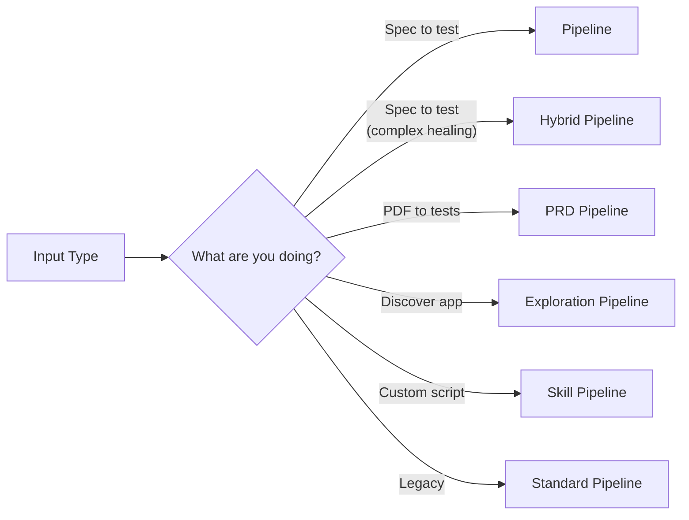
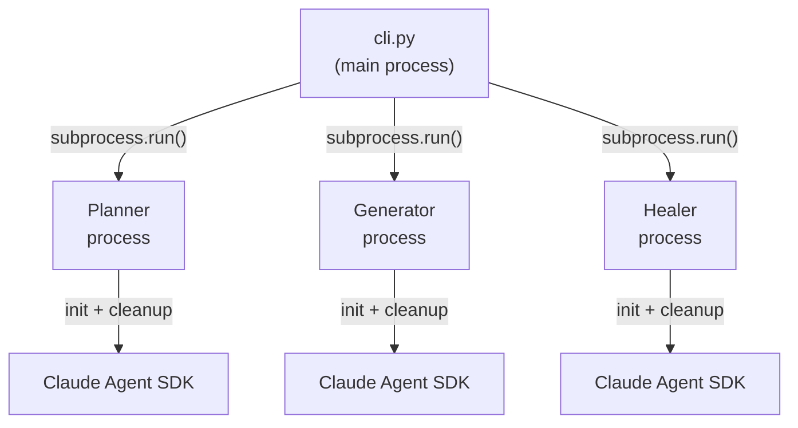
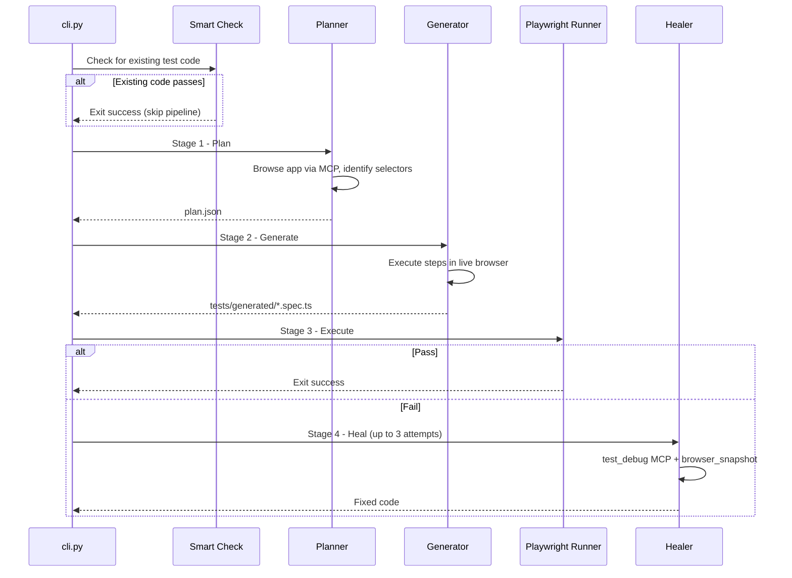
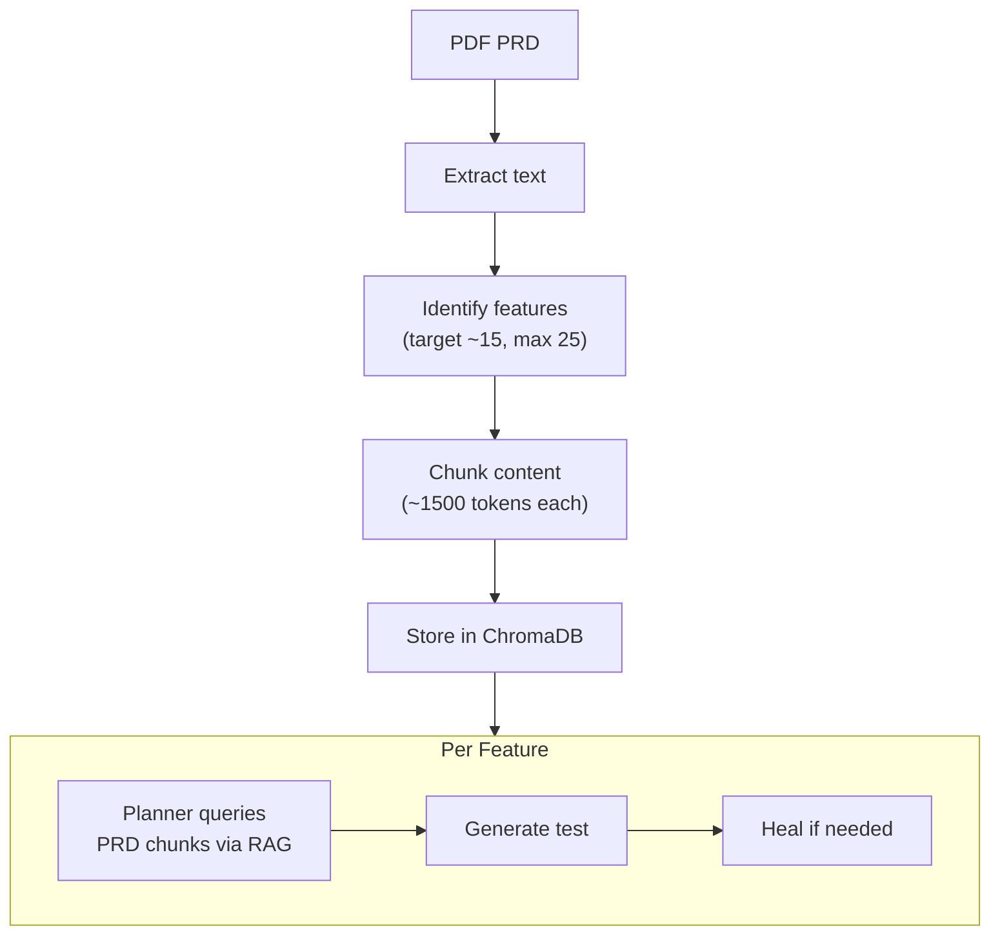
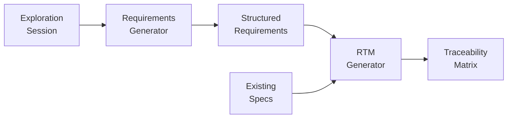
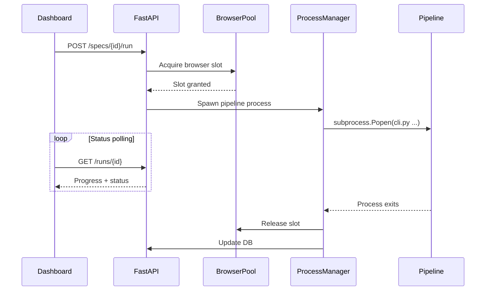

# Pipeline Architecture

Quorvex AI supports six pipeline types, each designed for a specific workflow. This document explains why they exist, how they differ, and when to choose each one.

## Why Multiple Pipelines

A single pipeline cannot serve all use cases well. Converting a markdown spec into a Playwright test requires different stages than extracting features from a PDF or autonomously exploring an unknown application. Rather than overloading one pipeline with conditional branches, the system provides focused pipelines that share common infrastructure (browser pool, memory system, agent runner) but differ in their stage composition.

### Pipeline Decision Guide

| Situation | Pipeline | Flag |
|-----------|----------|------|
| You have a markdown spec and want a test | Default | (default) |
| Tests keep failing after 3 healing attempts | Hybrid | `--hybrid` |
| You have a PRD (PDF) and want tests for each feature | PRD | `--prd` |
| You want to discover what an app does | Exploration | `--explore URL` |
| You need network interception or multi-tab | Skill | `--skill-mode` |
| You need the original 4-stage pipeline | Standard | `--standard-pipeline` |

## The Subprocess Execution Model

All pipeline stages run as **separate subprocesses**. This is the most important architectural decision in the pipeline engine.

**Why subprocesses?** The Claude Agent SDK uses async cancel scopes internally. When a scope is cancelled during cleanup, it can silently discard the accumulated result text -- the exact output you need from the stage. By running each stage in its own process, SDK cleanup errors are fully isolated. If the generator's cleanup fails, the planner's output is safe on disk and the healer can still start fresh.

**Trade-offs:**
- Process spawning adds ~1-2 seconds of overhead per stage
- Communication happens through file artifacts (`plan.json`, `.spec.ts`, `status.txt`) and exit codes
- Each process initializes its own SDK instance, consuming additional memory
- Debugging requires checking per-stage logs rather than a single process

The reliability benefit outweighs these costs. A pipeline that occasionally loses its output is useless; a pipeline that is slightly slower but always produces results is production-ready.

## Pipeline (Default)

The native pipeline uses a live browser at every stage, making it the most reliable option for test generation.

### Smart Check (Stage 0)

Before running the full pipeline, the CLI looks for existing generated code. If a test file already exists and passes, the pipeline exits immediately. If it exists but fails, the system enters healing-only mode. Full regeneration only happens when no code exists or healing fails.

This optimization matters in CI/CD where specs are re-run frequently. A spec that was generated yesterday does not need regeneration today -- it just needs validation.

### Why Browser at Every Stage

The planner browses the target application to discover actual selectors, page structure, and navigation flows. The generator executes each test step in a live browser, capturing the selectors that actually work. The healer uses `test_debug` to pause at the failure point and inspect the real page state.

This "browser-first" approach produces more reliable tests than text-only planning because it works with what the application actually renders, not what the spec describes.

## Hybrid Healing

When the native healer's 3 attempts are not enough, hybrid mode escalates to Ralph Validator for deeper, architectural fixes.

| Aspect | Healer | Ralph Validator |
|--------|--------------|-----------------|
| Max attempts | 3 | Up to 17 more (20 total) |
| Context | Fresh each attempt | Persistent conversation history |
| Fix scope | Selector, timing, assertion | May rewrite test structure |
| Completion signal | Test passes | `TESTS_PASSING` token |

**Why two healers?** The native healer is fast and targeted -- it fixes obvious selector mismatches and timing issues. But some failures require understanding the broader test context: a login flow that changed its redirect behavior, or a form that now uses a multi-step wizard. Ralph maintains conversation history across attempts, building a deeper understanding of the failure pattern.

The cost is time. Hybrid mode can run for 20 iterations, each involving a full test execution. Use it when the native healer fails on a spec you know should work.

## PRD Pipeline

Converts a PDF Product Requirements Document into multiple test specs and generated tests.

**Why RAG over full context?** PRDs can be 50+ pages. Passing the entire document to each pipeline stage would exceed context limits and dilute focus. By chunking the PRD and storing it in ChromaDB, each feature's planner retrieves only the relevant sections via semantic search. This keeps the AI focused on the specific feature being tested.

## Exploration Pipeline

Autonomous AI-powered application discovery. The agent explores an app to catalog pages, flows, API endpoints, and form behaviors.

**Why exploration?** Many teams adopt Quorvex AI for applications that lack documentation. Rather than requiring users to write comprehensive specs from scratch, the exploration pipeline discovers what the application does, then feeds those discoveries into requirements generation and RTM creation.

Exploration results flow downstream:

The exploration agent uses configurable strategies (goal-directed, breadth-first, depth-first) and respects interaction limits to prevent runaway sessions.

## Skill Pipeline

For scenarios beyond what MCP tools support: network interception, multi-tab coordination, custom retry logic, performance measurement.

Skill scripts are plain JavaScript files using the Playwright API directly. The skill runner manages browser launch, timeout enforcement, and result capture. This provides an escape hatch when the declarative spec format cannot express a test requirement.

See the decision matrix in `.claude/skills/playwright/SKILL.md` for when to use skill mode versus a standard spec.

## Web Dashboard Integration

When pipelines run via the dashboard, the flow adds browser pool management and process tracking:

The `ProcessManager` tracks running processes and supports cancellation. `ProgressReporter` writes progress events that the API polls, giving the dashboard real-time feedback without WebSocket complexity.

## Related

- [System Overview](./system-overview.md) -- How pipelines fit into the larger architecture
- [Browser Pool](./browser-pool.md) -- Resource management for concurrent pipeline runs
- [Infrastructure](./infrastructure.md) -- How pipelines run in Docker and Kubernetes
- [Getting Started](../tutorials/getting-started.md) -- Run your first pipeline
- [Pipeline Modes](../guides/pipeline-modes.md) -- Practical guide for choosing a pipeline
