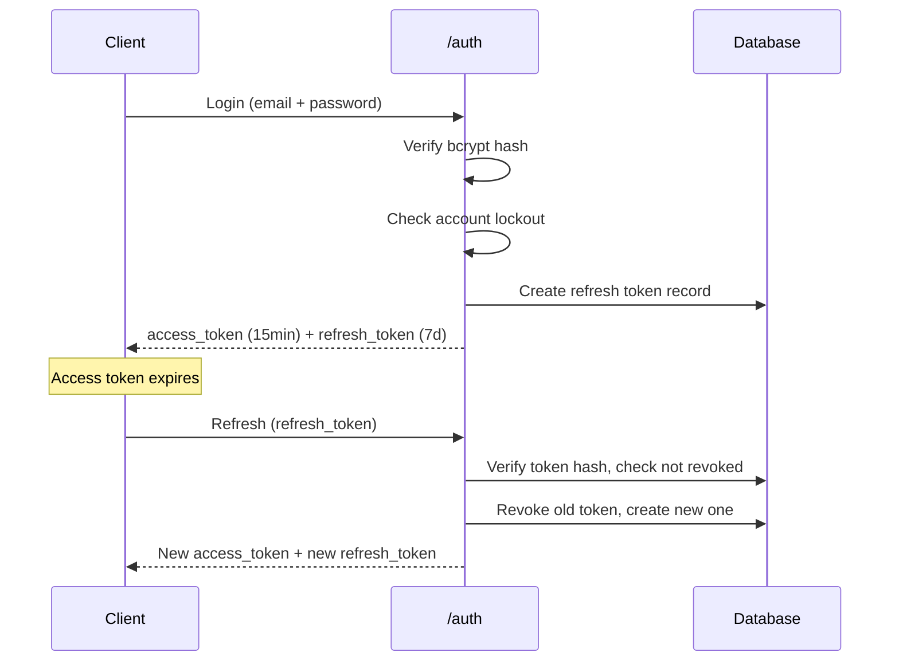
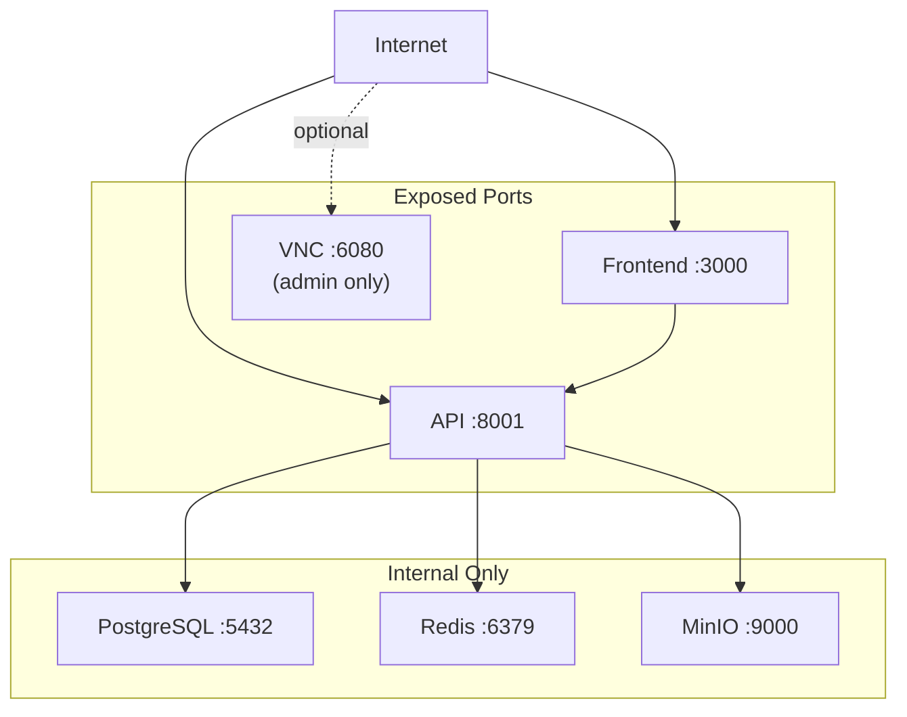

# Security Model

Quorvex AI's security model is built around defense in depth: multiple layers that each independently reduce risk. This document explains the design rationale behind authentication, authorization, credential management, and production hardening.

## Authentication Design

### Why JWT with Token Rotation

The authentication system uses short-lived access tokens (15 minutes) paired with rotating refresh tokens (7 days). This design balances security against user experience.



**Why 15-minute access tokens?** Access tokens are stateless -- the server validates them by signature alone, with no database lookup. This makes them fast but irrevocable. A 15-minute lifetime limits the window of exposure if a token is stolen. The server cannot invalidate an active access token, so keeping the lifetime short is the primary mitigation.

**Why rotating refresh tokens?** Each refresh token is single-use. When you use it to get a new access token, the old refresh token is revoked and a new one is issued. If an attacker steals a refresh token and uses it, the legitimate user's next refresh attempt will fail (because the token was already consumed), signaling a compromise. This is called "refresh token rotation" and it detects token theft.

**Why store refresh tokens as SHA-256 hashes?** If the database is compromised, an attacker cannot use raw refresh tokens extracted from the `refresh_tokens` table because they are stored as irreversible hashes. The actual token value exists only in the client's storage.

### Why bcrypt for Passwords

bcrypt was chosen over alternatives (argon2, scrypt, PBKDF2) for practical reasons:
- **Work factor is tunable**: 12 rounds (current setting) takes ~250ms per hash, making brute force impractical
- **Wide library support**: The `bcrypt` package is stable, well-audited, and available on all platforms
- **Salt is built-in**: bcrypt generates and stores a random salt automatically, eliminating a common implementation error

!!! note "Why not argon2?"
    Argon2 is technically superior (memory-hard, resistant to GPU attacks), but bcrypt with 12 rounds provides sufficient protection for a test automation platform. The authentication endpoints are also rate-limited, making offline brute force the only realistic attack vector -- which bcrypt handles well.

### Account Lockout Strategy

After 5 consecutive failed login attempts, the account is locked for 30 minutes. This protects against online brute force attacks while avoiding permanent lockouts that would require admin intervention.

The lockout is tracked per-user in the `users.locked_until` column, not per-IP. This means:
- An attacker cannot circumvent lockout by rotating IP addresses
- Legitimate users on shared IPs (corporate networks) are not affected by each other's failures
- Failed attempt counters reset on successful login

## Role-Based Access Control

### Why Per-Project Roles

Access control is scoped to projects rather than being global. A user can be an admin on Project A and a viewer on Project B. This supports organizations where different teams own different test suites.

| Role | Scope | Capabilities |
|------|-------|-------------|
| Superuser | Platform-wide | Full access, user management, all projects |
| Admin | Per-project | Manage members, full project access |
| Editor | Per-project | Create/edit/run specs and tests |
| Viewer | Per-project | Read-only access |

The `ProjectMember` join table maps users to projects with roles:

```
users (1) ---< project_members >--- (1) projects
                   |
                   +-- role: admin | editor | viewer
```

### Gradual Auth Migration

The `REQUIRE_AUTH` flag (default: `false`) enables teams to adopt authentication incrementally. With auth disabled, all endpoints work without tokens -- useful during initial setup and development. When ready, set `REQUIRE_AUTH=true` to enforce authentication.

This avoids the common problem of deploying auth that breaks existing integrations. Teams can migrate their CI/CD scripts and API clients to use tokens before flipping the switch.

## Rate Limiting Design

### Why Per-User, Not Per-IP

Rate limit keys are determined by authentication status:
- **Authenticated**: Keyed by user ID (`user:{id}`)
- **Unauthenticated**: Keyed by IP address

Per-user keying prevents users on shared networks (offices, universities) from exhausting each other's rate limits. A busy corporate network might have 100 users behind a single NAT IP -- per-IP limiting would unfairly restrict all of them.

### Rate Limit Tiers

Authentication endpoints have aggressive limits because they are the primary brute force target:

| Endpoint | Limit | Rationale |
|----------|-------|-----------|
| Login | 10/minute | Combined with lockout, prevents rapid credential stuffing |
| Register | 3/minute | Prevents automated account creation |
| Refresh | 30/minute | Higher limit since legitimate clients refresh frequently |

API endpoints have more generous limits (1000/hour global default) since they require authentication and abuse is less likely.

### Storage Backend

Rate limiting uses `slowapi` with pluggable backends:
- **Development**: In-memory storage (process-local, resets on restart)
- **Production**: Redis backend (distributed across API instances)

This means rate limits are shared across all API replicas in production, preventing an attacker from circumventing limits by hitting different backend instances.

## Credential Management

### Separation of Concerns

The system handles three types of credentials differently:

1. **AI provider credentials** (`.env`): Loaded by `load_env.py`, never stored in the database. The `.env` file is gitignored and must be configured per-deployment.

2. **Test credentials** (placeholder system): Defined in `.env`, referenced in specs as `{{VARIABLE_NAME}}`, expanded to `process.env.VARIABLE_NAME` in generated code. Secrets never appear in generated test files.

3. **Integration credentials** (encrypted in DB): TestRail API keys and database connection passwords are encrypted at rest in the `Project.settings` JSON column using Fernet symmetric encryption.

This layered approach means a database compromise does not expose AI API keys (they are in `.env`, not the database), and generated test code never contains hardcoded secrets.

## Network Security in Production



All services communicate over an internal Docker bridge network (`playwright-network`). PostgreSQL and Redis are never exposed outside the Docker network. The backend container drops from root to the `agent` user via the entrypoint script, and supervisord programs run with the same non-root user.

!!! danger "VNC Exposure"
    VNC access is restricted to superusers in the application layer, but the WebSocket port (6080) is exposed on the Docker host. In production, use a firewall or nginx reverse proxy to restrict VNC access to trusted networks.

## Container Security

The Docker image implements:
- **Non-root execution**: The `agent` user runs all application processes
- **Privilege dropping**: The entrypoint script runs as root only to fix volume permissions, then drops to `agent` via `gosu`
- **Resource limits**: Docker Compose enforces `deploy.resources` limits per container
- **Shared memory limits**: `shm_size` prevents Chromium from consuming unbounded memory

## Production Hardening

For a production deployment, the critical security settings are:

- `JWT_SECRET_KEY`: Unique, random 32-byte hex value (`openssl rand -hex 32`)
- `REQUIRE_AUTH=true`: Enforce token validation on all endpoints
- `ALLOW_REGISTRATION=false`: Prevent unauthorized account creation
- `REDIS_URL`: Enable distributed rate limiting
- TLS termination via nginx reverse proxy
- `ALLOWED_ORIGINS`: Restrict CORS to your actual frontend domain

For the complete checklist, see the [deployment guide](../guides/deployment.md).

## Related

- [System Overview](./system-overview.md) -- How security fits into the overall architecture
- [Infrastructure](./infrastructure.md) -- Network topology and container design
- [Environment Variables](../reference/environment-variables.md) -- Security-related configuration
- [Deployment Guide](../guides/deployment.md) -- Production hardening steps
