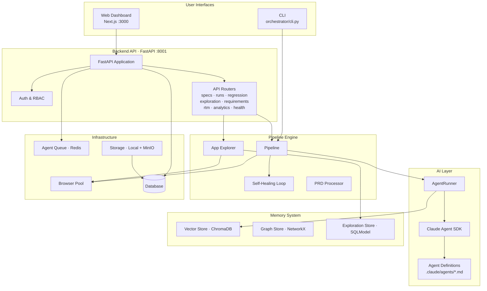
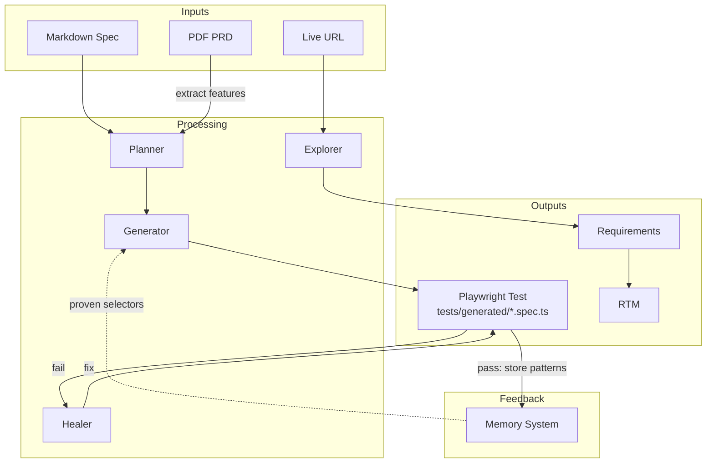

# System Architecture Overview

Quorvex AI converts natural language test specifications into production-ready Playwright tests through a layered architecture of user interfaces, pipeline engines, AI agents, and infrastructure services.

## Why This Architecture

The system solves a fundamental tension: AI-powered test generation requires orchestrating multiple long-running, stateful operations (browser automation, LLM conversations, file I/O) while remaining responsive and scalable. Rather than building a monolith, the architecture separates concerns into loosely coupled layers that communicate through well-defined interfaces.

## Dual-Interface Design

The platform exposes two interfaces -- CLI and Web Dashboard -- that share the same backend logic but serve different use cases.

**CLI** (`orchestrator/cli.py`) is optimized for automation and CI/CD. It spawns pipeline stages as subprocesses, communicates through file artifacts (JSON, exit codes, stdout), and requires no database. This makes it suitable for scripting, one-off runs, and environments where a web server is unwanted.

**Web Dashboard** (`web/` + `orchestrator/api/`) adds persistence, collaboration, and monitoring. The Next.js frontend communicates with a FastAPI backend over HTTP. This mode requires a database (PostgreSQL in production, SQLite for development) and enables features like regression batches, scheduled runs, and team collaboration.

!!! note "Why two interfaces?"
    Many teams start with the CLI during evaluation, then adopt the dashboard as usage grows. Keeping both interfaces ensures the core pipeline logic never depends on a web server, which simplifies testing and debugging.

## Component Interaction Trade-offs

### Subprocess Isolation

Every pipeline stage runs as a **separate subprocess**. This is the single most important architectural decision. The Claude Agent SDK throws "cancel scope" errors during cleanup that can discard accumulated results. By isolating each stage, cleanup errors in one stage cannot corrupt another. The cost is slightly higher latency from process spawning, but reliability wins over speed for a tool that generates production test code.

For details on the subprocess model, see [Pipeline Architecture](./pipeline-architecture.md).

### Stateless API, Stateful Workers

The FastAPI backend is intentionally stateless -- it delegates long-running work to background processes or the agent queue. This means you can run multiple API instances behind a load balancer without sticky sessions. Browser operations are managed through the [browser pool](./browser-pool.md), and agent tasks flow through a Redis queue when available.

### Memory as an Optimization Layer

The [memory system](./memory-system.md) is designed as an optimization, not a requirement. Pipelines work without it, but memory improves quality by passing proven selectors to generators and feeding exploration discoveries into requirements generation. This design means a failed ChromaDB instance degrades performance gracefully rather than blocking test generation.

## Technology Stack

| Layer | Technology | Why This Choice |
|-------|-----------|----------------|
| Frontend | Next.js (App Router), React, Tailwind | Server components for fast loads; Tailwind for rapid UI iteration |
| Backend API | FastAPI, Uvicorn, SQLModel | Async-first for browser operations; SQLModel bridges Pydantic and SQLAlchemy |
| AI | Claude Agent SDK, Anthropic API | MCP tool support enables live browser interaction during generation |
| Database | PostgreSQL (prod), SQLite (dev) | SQLite for zero-config development; PostgreSQL for production concurrency |
| Browser | Playwright | Multi-browser support; best-in-class auto-wait and selector APIs |
| Memory | ChromaDB (vector), NetworkX (graph) | Embedded mode avoids external services; cosine similarity for selector matching |
| Queue | Redis | Lightweight, battle-tested; doubles as rate limit and session store |
| Storage | MinIO (S3-compatible) | Self-hosted object storage for artifact archival without cloud vendor lock-in |

## Data Flow

The system transforms input (markdown specs, PDFs, live URLs) into output (passing Playwright tests, requirements, traceability matrices) through feedback loops:

The healing loop is central to reliability. When a generated test fails, the healer analyzes the browser state at the failure point and fixes the code. This loop runs up to 3 times with the native healer and up to 20 times in hybrid mode. Each successful run feeds selector patterns back into the memory system, making future generations more accurate.

## Credential Flow

All AI credentials load from `.env` via `orchestrator/load_env.py`. The `setup_claude_env()` function must be called before any Agent SDK usage. Per-project credentials (stored encrypted in `Project.settings`) override `.env` values at runtime, enabling multi-tenant deployments where different teams use different API keys.

## Related

- [Pipeline Architecture](./pipeline-architecture.md) -- Why subprocess execution and how pipeline types differ
- [Memory System](./memory-system.md) -- How vector and graph stores improve test quality
- [Browser Pool](./browser-pool.md) -- Concurrency management and resource protection
- [Infrastructure](./infrastructure.md) -- Deployment topology trade-offs
- [Security Model](./security-model.md) -- Authentication and authorization design
