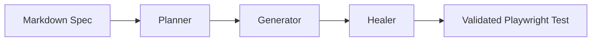

---
hide:
  - navigation
---

# Quorvex AI

**AI-powered test automation that converts natural language into production-ready Playwright tests.**

Write your tests in plain English. Quorvex AI reads your markdown specifications, explores the target application with a real browser, generates validated Playwright TypeScript code, and self-heals failures automatically -- no manual scripting required.

<div class="grid cards" markdown>

-   :material-text-box-outline: **Natural Language Specs**

    ---

    Write test cases in plain markdown. Describe what to test in English and the AI pipeline handles the rest -- planning, code generation, and validation.

-   :material-auto-fix: **AI Self-Healing**

    ---

    When tests break due to UI changes, the Healer automatically debugs failures and regenerates working code in up to 3 repair cycles.

-   :material-monitor-dashboard: **Web Dashboard**

    ---

    Full-featured web interface for managing specs, viewing run results, tracking regression batches, and monitoring system health in real time.

-   :material-layers-outline: **Multi-Domain Testing**

    ---

    Go beyond UI tests. Generate and run API tests, load tests (K6), security scans (ZAP + Nuclei), database quality checks, and LLM evaluations from a single platform.

-   :material-compass-outline: **App Exploration**

    ---

    AI-powered autonomous exploration discovers pages, user flows, API endpoints, and form behaviors. Findings feed directly into requirements generation and RTM creation.

-   :material-shield-lock-outline: **Enterprise Ready**

    ---

    Multi-tenant project isolation, role-based access control, CI/CD integrations (GitHub Actions, GitLab CI), TestRail sync, Jira linking, and cron scheduling built in.

</div>

## How It Works

Quorvex AI uses a three-stage **Pipeline** to convert specifications into tests:



1. **Plan** -- The Planner reads your spec, launches a browser to explore the target app, and produces a structured execution plan.
2. **Generate** -- The Generator uses the plan and live browser context to write Playwright TypeScript code.
3. **Heal** -- If the generated test fails validation, the Healer debugs the failure and repairs the code automatically.

Each stage runs as an isolated subprocess with full browser access, ensuring reliable execution and clean resource management.

## Quick Start

```bash
# Clone the repository
git clone https://github.com/NihadMemmedli/quorvex_ai.git
cd quorvex_ai

# Configure your credentials
cp .env.prod.example .env.prod
# Edit .env.prod with your ANTHROPIC_AUTH_TOKEN

# Start all services (backend, frontend, PostgreSQL, Redis, MinIO, VNC)
make prod-dev
```

Then open [http://localhost:3000](http://localhost:3000) to access the dashboard.

!!! tip
    `make prod-dev` mounts your local code for hot-reload -- no rebuild needed after code changes. See the [Getting Started](tutorials/getting-started.md) tutorial for the full walkthrough.


## Next Steps

<div class="grid cards" markdown>

-   :material-rocket-launch-outline: **[Getting Started](tutorials/getting-started.md)**

    ---

    Your first test in 10 minutes. Clone, setup, write a spec, and see a passing Playwright test.

-   :material-api: **[First API Test](tutorials/first-api-test.md)**

    ---

    Import an OpenAPI spec and generate validated API tests automatically.

-   :material-compass-outline: **[Explore an App](tutorials/first-exploration.md)**

    ---

    Use AI exploration to discover flows, generate requirements, and build a traceability matrix.

-   :material-monitor-dashboard: **[Dashboard Tour](tutorials/dashboard-walkthrough.md)**

    ---

    Visual walkthrough of the web dashboard and its key features.

-   :material-book-open-variant: **[How-to Guides](guides/writing-specs.md)**

    ---

    Task-oriented guides for API testing, load testing, security scans, scheduling, integrations, and more.

-   :material-file-document-outline: **[Reference](reference/cli.md)**

    ---

    Complete CLI flags, API endpoints, environment variables, database schema, and Makefile commands.

-   :material-sitemap: **[Architecture](explanation/system-overview.md)**

    ---

    Understand the pipeline design, memory system, browser pool, and scaling model.

-   :material-github: **[GitHub Repository](https://github.com/NihadMemmedli/quorvex_ai)**

    ---

    Star the project, browse the source, and open issues or pull requests.

</div>
